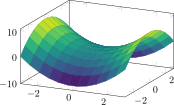
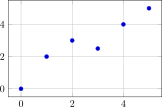
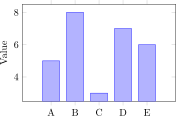
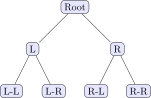
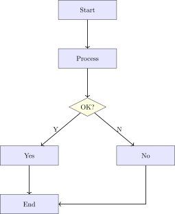
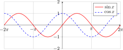

# obsidian-tk

使用本地 LaTeX 工具链在 Obsidian 中渲染 TikZ 图表。支持 pgfplots、动图、暗色模式，提供 IDE 级自动补全。

## 功能

- **本地编译**：latex → DVI → dvisvgm + libgs → SVG，可使用系统所有 LaTeX 宏包
- **智能包裹**：裸 `\draw`/`\node`/`\fill`/`\foreach` 等命令自动包裹 `tikzpicture` 环境
- **库自动加载**：根据内容自动加载 mindmap、automata、circuits、fillbetween、polar、cd 等库
- **动图支持**：beamer 覆盖 (`\onslide`/`\pause`/`\only`) 自动切 beamer 文档类，多页 SVG 轮播，悬停显示播放控件
- **暗色模式**：自动反转 SVG 颜色（黑→currentColor，白→背景色）
- **智能补全**：`\` 命令、`{}` 环境名、`[]` 样式选项、`()` 坐标、空行弹出 18 种结构模板
- **自动缓存**：MD5 哈希 + IndexedDB，源码不变不重新编译

## 依赖

| 工具 | 用途 | macOS 默认路径 |
|------|------|---------------|
| LaTeX (texlive) | 编译 TikZ 为 DVI | `/Library/TeX/texbin/latex` |
| dvisvgm | DVI 转 SVG | `/Library/TeX/texbin/dvisvgm` |
| Ghostscript | PostScript specials (pgfplots 必需) | `/opt/homebrew/lib/libgs.dylib` |

安装 TeX Live：`brew install --cask mactex` 或 <https://tug.org/mactex/>  
安装 Ghostscript：`brew install ghostscript`

## 安装

1. 下载 [最新 Release](https://github.com/geeksmy/obsidian-tk/releases) 中的 `main.js`、`manifest.json`、`styles.css`
2. 放入 `{仓库}/.obsidian/plugins/obsidian-tk/`
3. 重启 Obsidian，设置 → 第三方插件 → 启用 "Tk Render"

## 用法

### 基本绘图


````markdown
```tk
\draw[->, thick, blue] (0,0) -- (3,2) node[right] {$\vec{v}$};
\draw[->, thick, red] (0,0) -- (3,-1) node[right] {$\vec{w}$};
```
````

插件自动包裹 `\begin{tikzpicture}...\end{tikzpicture}`，无需手动写。

### 函数图像


````markdown
```tk
\begin{axis}[
    axis lines=middle,
    xmin=-5, xmax=5, ymin=-5, ymax=5,
    grid=both,
    title={$f(x)=x^2-4$},
]
    \addplot[thick, blue] {x^2 - 4};
\end{axis}
```
````

> `title` 中含有 `=` 时需要用 `{}` 括起来，如 `title={$f(x)=x^2$}`。

### 动图 (beamer 逐帧)


````markdown
```tk
\begin{tikzpicture}
    \onslide<1->{ \draw (0,0) circle (1); }
    \onslide<2->{ \draw (2,0) circle (1); }
    \onslide<3->{ \draw (4,0) circle (1); }
\end{tikzpicture}
```
````

支持 `\onslide`、`\only`、`\pause`、`\visible` 等 beamer 覆盖命令，自动检测并切换 beamer 文档类。

### 3D 曲面



````markdown
```tk
\begin{axis}[view={25}{30},colormap/viridis]
  \addplot3[surf,domain=-3:3,y domain=-3:3,samples=30] {x^2 - y^2};
\end{axis}
```
````

### 散点图



````markdown
```tk
\begin{axis}[only marks, mark=*, grid=major]
  \addplot coordinates { (0,0) (1,2) (2,3) (3,2.5) (4,4) (5,5) };
\end{axis}
```
````

### 柱状图



````markdown
```tk
\begin{axis}[ybar, bar width=0.6cm, enlarge x limits=0.3,
             symbolic x coords={A,B,C,D,E}, xtick=data]
  \addplot coordinates {(A,5) (B,8) (C,3) (D,7) (E,6)};
\end{axis}
```
````

### 树形图



````markdown
```tk
\begin{tikzpicture}[level 1/.style={sibling distance=3cm},
                    every node/.style={draw,rounded corners,fill=blue!10}]
  \node {Root}
    child { node {L} child { node {L-L} } child { node {L-R} } }
    child { node {R} child { node {R-L} } child { node {R-R} } };
\end{tikzpicture}
```
````

### 流程图



````markdown
```tk
\begin{tikzpicture}[node distance=2.5cm,
  block/.style={draw,rectangle,minimum width=3cm,minimum height=1cm,fill=blue!10},
  decision/.style={draw,diamond,aspect=2,fill=yellow!10},
  arrow/.style={->,thick}]
  \node[block] (start) {Start};
  \node[block,below of=start] (proc) {Process};
  \node[decision,below of=proc] (dec) {OK?};
  \node[block,below of=dec,xshift=-3cm] (yes) {Yes};
  \node[block,below of=dec,xshift=3cm] (no) {No};
  \node[block,below of=yes] (end) {End};
  \draw[arrow] (start) -- (proc);
  \draw[arrow] (proc) -- (dec);
  \draw[arrow] (dec) -- node[left] {Y} (yes);
  \draw[arrow] (dec) -- node[right] {N} (no);
  \draw[arrow] (yes) -- (end);
  \draw[arrow] (no) |- (end);
\end{tikzpicture}
```
````

### 三角函数



````markdown
```tk
\begin{axis}[axis lines=center,
  xmin=-6.28, xmax=6.28, ymin=-2, ymax=2,
  xtick={-6.28,-3.14,0,3.14,6.28},
  xticklabels={$-2\pi$,$-\pi$,$0$,$\pi$,$2\pi$},
  grid=major, legend pos=north east]
  \addplot[thick,red,domain=-6.28:6.28,samples=200] {sin(deg(x))};
  \addlegendentry{$\sin x$}
  \addplot[thick,blue,dashed,domain=-6.28:6.28,samples=200] {cos(deg(x))};
  \addlegendentry{$\cos x$}
\end{axis}
```
````

## 自动补全

在 `tk` 代码块内：

| 触发方式 | 补全内容 |
|----------|----------|
| `\` + 字母 | 命令（`\draw`、`\begin`、`\addplot`、`\foreach` …） |
| `\begin{` | 环境名（`tikzpicture`、`axis`、`scope`、`tikzcd` …） |
| `\usetikzlibrary{` | 库名（`arrows`、`calc`、`patterns`、`mindmap` …） |
| `\usepackage{` | 包名（`pgfplots`、`amsmath`、`circuitikz` …） |
| `\addlegendentry{` | 常用图例文本 |
| `[...]` 方括号内 | 样式选项（`thick`、`->`、`red`、`xmin=`、`opacity=` …） |
| `(...)` 圆括号内 | 坐标/路径（`0,0`、`--`、`++`、`arc`、`node` …） |
| 空行输入 | 18 种结构模板（函数图、3D 曲面、散点图、流程图、树形图…） |

## 设置

| 选项 | 说明 |
|------|------|
| LaTeX 编译器路径 | 留空自动检测 |
| dvisvgm 路径 | 留空自动检测 |
| Ghostscript 库路径 | 留空自动检测 |
| 暗色模式颜色反转 | 默认开启 |
| 清除缓存 | 手动清除所有缓存的 SVG |

## 许可

MIT
